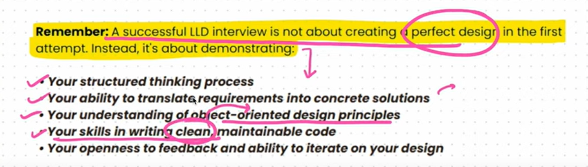

## Basic components of LLD

- Requirement Gathering (constraints) -> make a activity diagram (Plain English)
- Grab entities out of the activity diagram . (Dervie use cases)
- UML Diagrams (class, activity, sequence)
- Write design patterns to code it out.
- Write a clean , modular, and efficient code.

## Approaching a LLD Problem in an interview..

- ask the critical component to build in the interview to the interviewer. (Ask the constraints)
- write the flow or the activity diagram.
- Get the entities out of the activity diagram. (Write all the core entities in c++)
- Use design patterns (That's what interviewers are expecting)
- more verbal and interactive we should be and ask out the interviewer what we should write as code without blindly coding out something..

## OOPS Recap important key points.

- A private constructor is used to create singleton object by restricting the object creation outside the class.
- this() -> is used to call the constructor of the class within the class
- super() -> is used to call the constructor of the parent class.
- constructor cannot return a value but it can have a empty return;
- method chaining is the method of returning a this object from a method and chaining it with other method . obj.method1().method2(); -> used in builder design pattern.
- static method can't use this method since it doesn't belong to any instance.
-  when we write Vehicle obj = new Car() it means at compile time the obj is treated as Vehicle object can only call the Vehicle methods , only in the runtime The car object is instantiated and the obj gets the car methods access but throws error when used in compile time. (Runtime polymorphism)
- A abstract class is a class that have atleast one pure virtual function . syntax : virtual void func () = 0;
- Interface in c++ are not there hence we use only abstract class to do so.