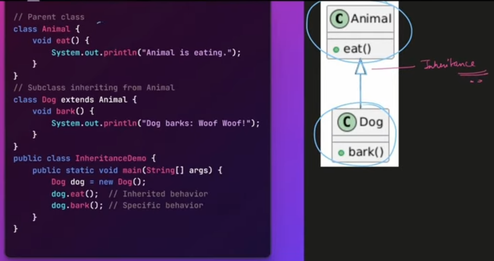
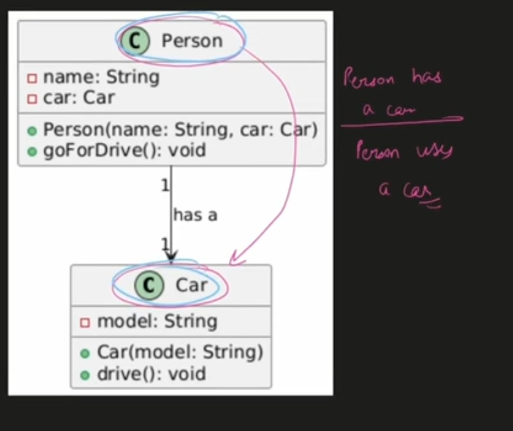
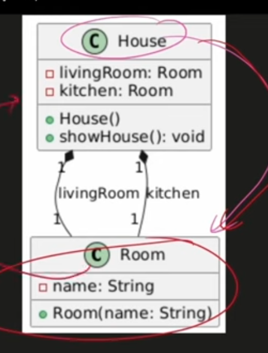
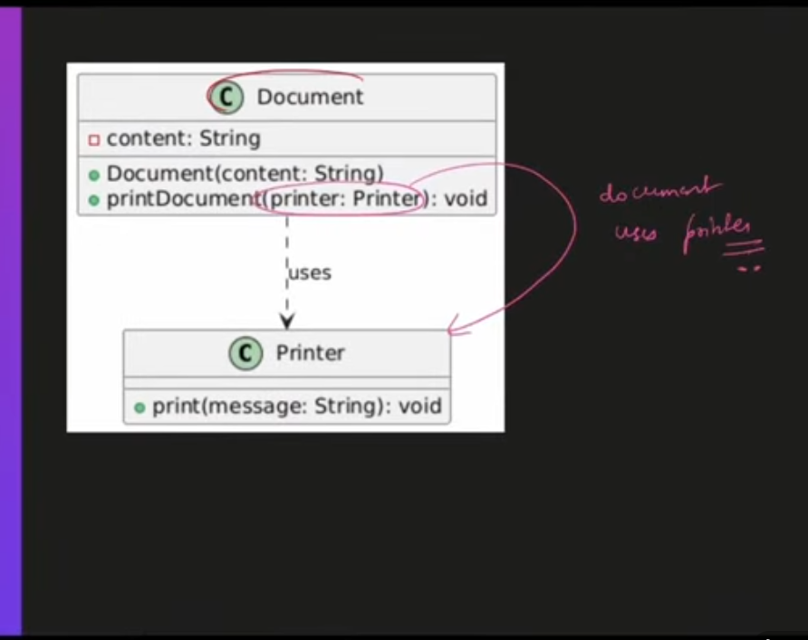
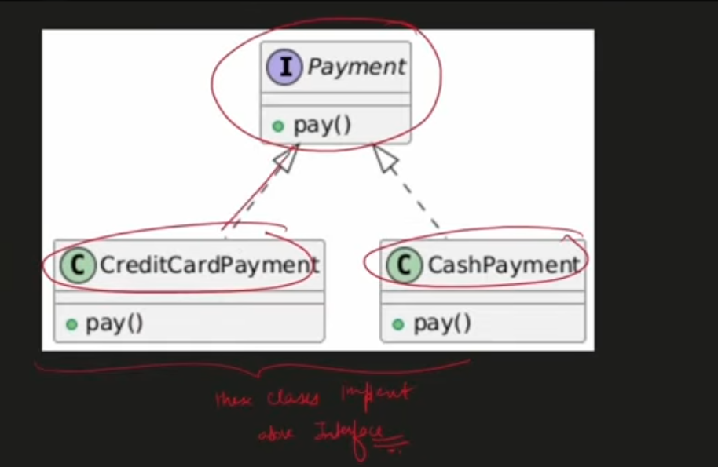
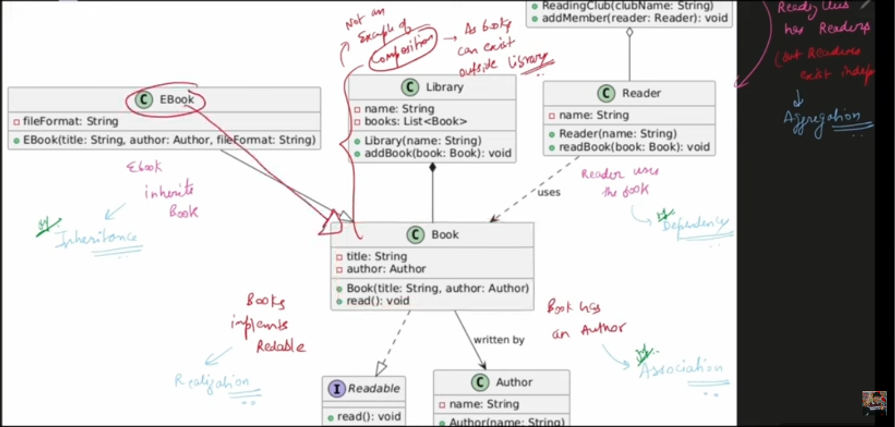

# Notations

## Inheritance

## Association

- one class is related with another class but not inherited or something like a person owns a car.

## Composition

- All the associated objects will be destroyed if the association is destroyed.

## Dependency

- one class temporarily uses another class object in the method scope.

## Realization

- When a class implements a interface

