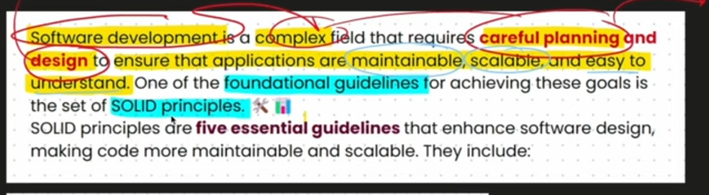
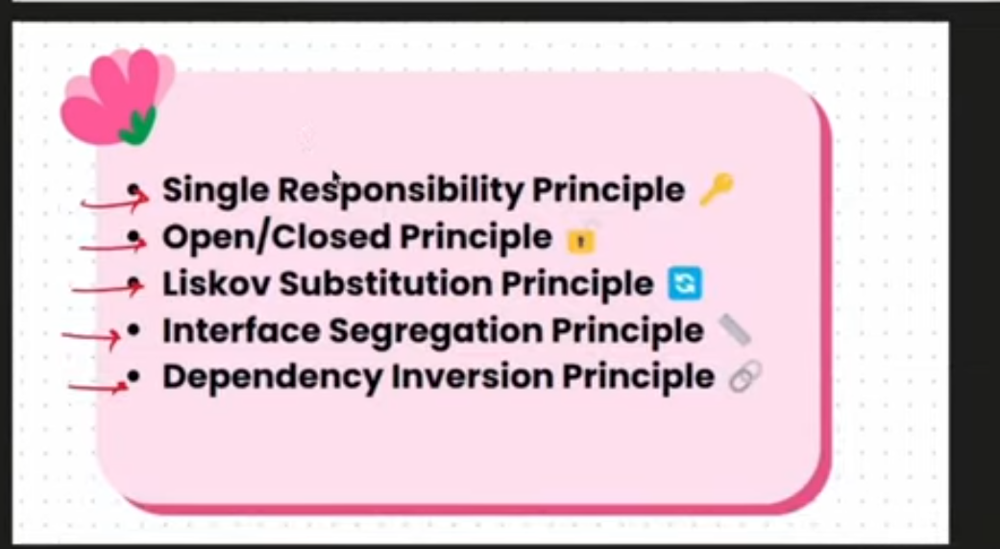
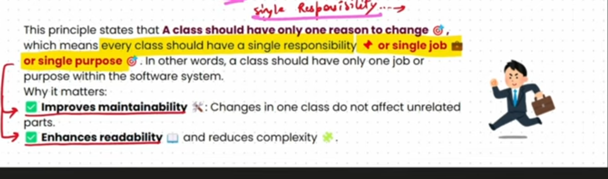
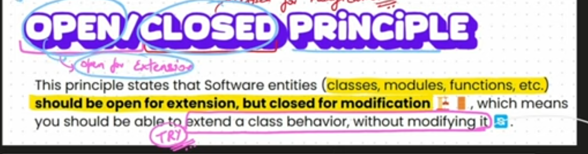
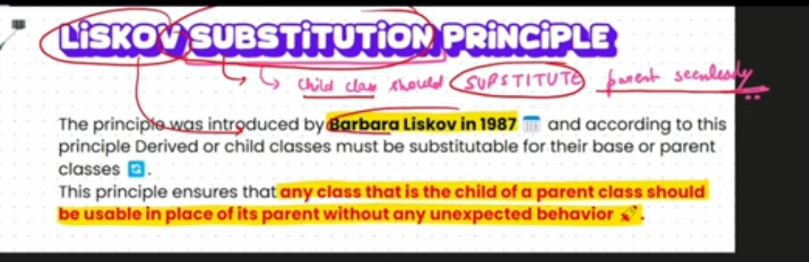
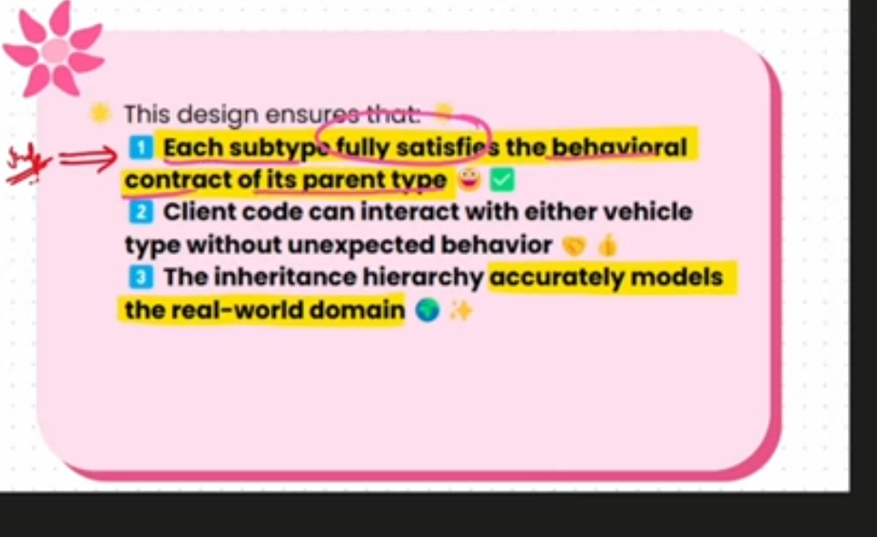
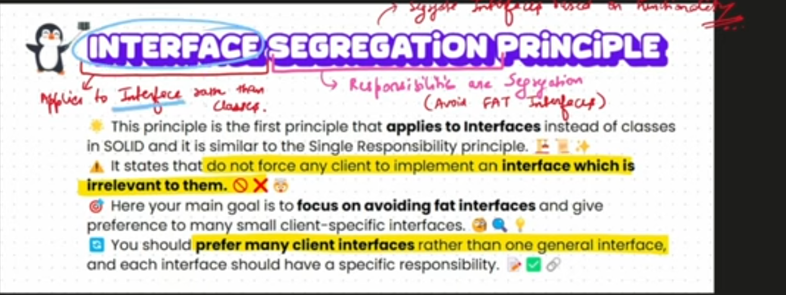
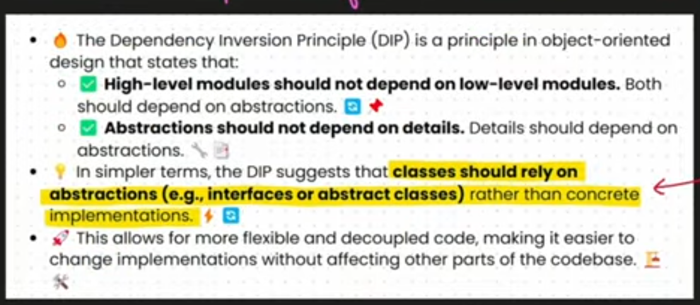

# Design principles:

## SOLID:

### Single Responsibility :

### Open / Closed Principle :

 

 ### Liskov Substitution Principle :
 

### Integration Seggregation principle :

### Dependency Inversion Principle :

## DRY (Don't Repeat Yourself)

- Don't Repeat the code make modular and reusable code.. That's all

## KISS (Keep it simple and stupid) 

- Write names correctly. Simple means simple for others to read not for us..

## YAGNI (You aren't gonna need it)

- Is just nothing but don't write the code that you don't need it to showcase that you can do it unless it is needed.